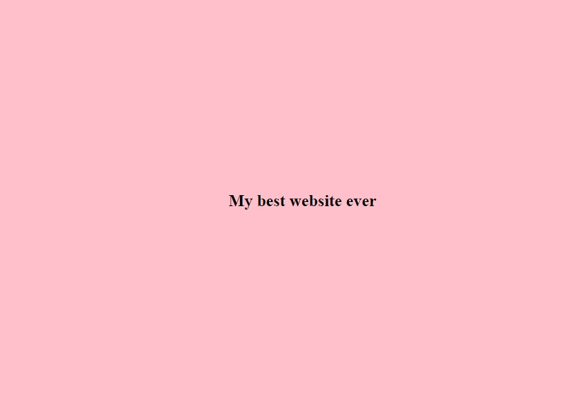
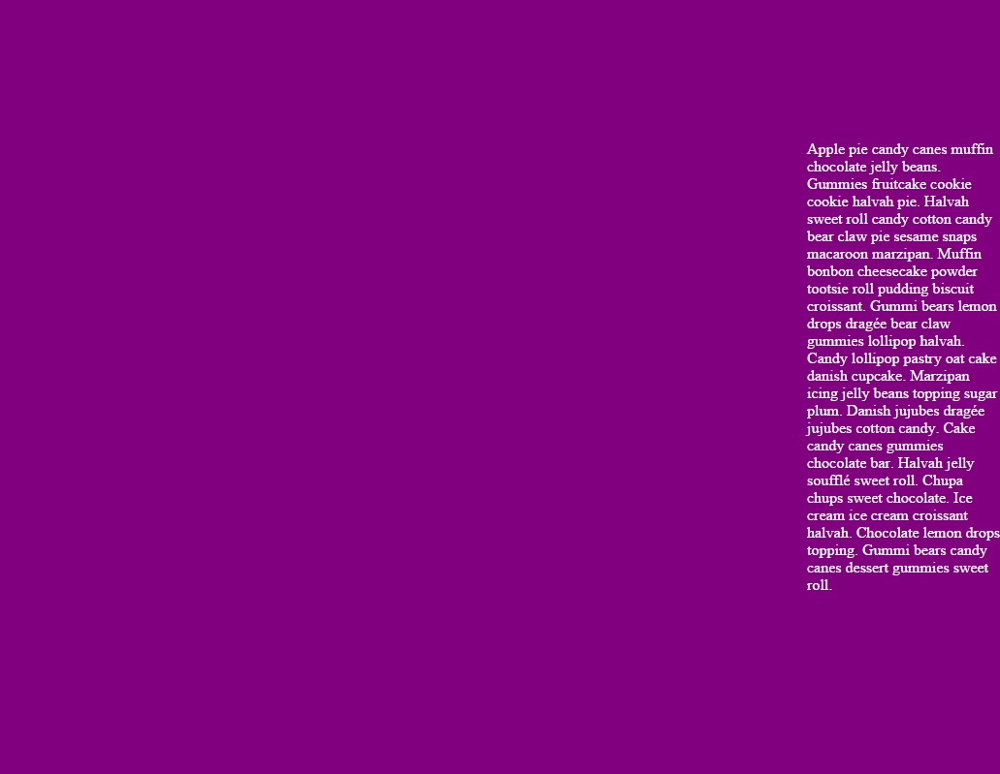

# Sass i RWD &ndash; egzamin

## Wytyczne dotyczące repozytorium

1. Żeby zacząć, stwórz tak zwany [**fork**][forking] repozytorium z zadaniami.
2. Następnie [**sklonuj**][ref-clone] repozytorium na swój komputer.
3. Rozwiąż zadania i [**skomituj**][ref-commit] zmiany do swojego repozytorium.
4. [**Wypchnij**][ref-push] zmiany na swoje repozytorium na GitHubie.
5. [Stwórz **pull request**][pull-request] do oryginalnego repozytorium, gdy skończysz egzamin.

**Wszystkie style piszemy w Sassie!**

## Zadanie 1
Zdefiniuj za pomocą Sassa trzy kolory:
* pierwszy &ndash; dowolny, będzie to kolor bazowy,
* drugi &ndash; jaśniejszy od bazowego o **10%**,
* trzeci &ndash; ciemniejszy od bazowego o **10%**.

## Zadanie 2
W pliku **index.html** jest przygotowana lista z **klasą** ```menu```. Ostyluj listę za pomocą Sassa w taki sposób,
aby jej elementy wyświetlały się obok siebie, natomiast na ekranach mniejszych niż **650px** &ndash; menu znikało i pojawiał się napis **MENU**.
Po kliknięciu w element powinno się rozwinąć ukryte menu oraz schować po kolejnym kliknięciu.  

## Zadanie 3
W pliku **index.html** są przygotowane cztery sekcje. Ostyluj je w taki sposób, aby każda z nich zajmowała **100%** wysokości i szerokości viewportu i każda miała inny kolor np. te zdefiniowane w zadaniu pierwszym.

## Zadanie 4
W sekcji pierwszej znajduje się element **h1**. Wyśrodkuj go w pionie i poziomie na środku sekcji, przykład:



## Zadanie 5
W sekcji drugiej znajduje się paragraf **p**. Umieść go tak, aby przylegał do prawej krawędzi okna przeglądarki	oraz był wyśrodkowany w pionie, przykład:



## Zadanie 6
Stwórz mixin, dzięki któremu z łatwością będzie można ustawić element z responsywnym tłem &ndash; ```background-image```. Mixin ma przyjmować jako parametr naturalną szerokość i wysokość obrazka. Ma on wykorzystać wysokość i szerokość do rozepchania tła za pomocą ```padding-bottom```. Pamiętaj o ustawieniu ```height``` na **0**.

## Zadanie 7
Stwórz mixin, za pomocą którego będzie można ustawić kolor obramowania dla dowolnego elementu np. okienka dialogowego. Wywołanie mixina wygląda ma wyglądać następująco: ```@include dialog-box(blue)```
Mixin powinien ustawiać również ```box-shadow```, ```padding``` i wielkość okienka. Tylko kolor jest przyjmowany jako parametr. Stwórz przykładowy element, któremu nadasz style przez mixin.


<!-- Links -->
[forking]: https://guides.github.com/activities/forking/
[ref-clone]: http://gitref.org/creating/#clone
[ref-commit]: http://gitref.org/basic/#commit
[ref-push]: http://gitref.org/remotes/#push
[pull-request]: https://help.github.com/articles/creating-a-pull-request
